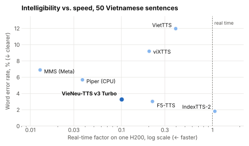
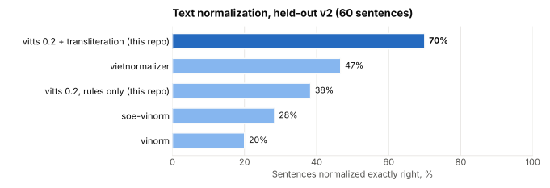
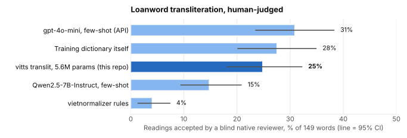

# ViTTS-Bench

**An open, reproducible benchmark for Vietnamese text-to-speech**, plus a Vietnamese text normalizer and one OpenAI-compatible API for every model.

[](https://github.com/yoonjae26/vietnamese-tts/actions/workflows/ci.yml)
[](LICENSE)


🎧 **[Listen to all 7 models read the same sentences](https://yoonjae26.github.io/vietnamese-tts/listen/)** · 📊 **[Full results](docs/RESULTS.md)**

## Highlights

- **7 open Vietnamese TTS models**, one shared test set, one scoring pipeline.
- **VieNeu-TTS v3 Turbo** is the best all-rounder for products: 3.3% WER, 10× faster than real time, Apache-2.0.
- **WER alone misses failures:** some models finish the sentence and then keep generating silence. The benchmark adds a check for this.
- **Text normalizer vitts 0.2** reads numbers, dates, units, acronyms and loanwords. It gets **70%** of held-out sentences exactly right; the next best tool gets 47%.
- **A 5.6M-parameter loanword model** matches gpt-4o-mini in a blind human review and beats Qwen2.5-7B, using 0.1 GB of VRAM.

## TTS models

<picture>
  <source media="(prefers-color-scheme: dark)" srcset="docs/assets/tts-dark.svg">
  
</picture>

- **IndexTTS-2** is the clearest (1.8% WER) but slower than real time and needs 8.9 GB of VRAM.
- **F5-TTS** is nearly as clear and light, but non-commercial. **MMS** and **Piper** are tiny and fast, and struggle with tongue twisters.
- **Voice-cloning results depend on the reference voice.** Swapping it made one failure mode disappear and moved viXTTS from best to worst on voice similarity. [Details →](docs/RESULTS.md#tts-models)

## Text normalization

<picture>
  <source media="(prefers-color-scheme: dark)" srcset="docs/assets/normalization-dark.svg">
  
</picture>

TTS models only read letters, so `"100k"`, `"14h30"`, `"TP.HCM"` and `"iPhone"` must be spelled out first. The held-out set was committed before vitts 0.2 was written and never used for tuning. [Details →](docs/RESULTS.md#text-normalization)

```python
from vitts import normalize_text

normalize_text("Giá 100k, họp online lúc 14h30 tại TP.HCM.", translit="auto")
# 'giá một trăm nghìn, họp ôn lai lúc mười bốn giờ ba mươi phút tại thành phố hồ chí minh.'
```

## Loanword transliteration

<picture>
  <source media="(prefers-color-scheme: dark)" srcset="docs/assets/translit-dark.svg">
  
</picture>

A native speaker reviewed 150 words blind, without knowing which system produced which reading. The small model is **on par with gpt-4o-mini** (the gap is not statistically significant) and **significantly better than Qwen2.5-7B**. The dictionary it learns from is itself accepted only 28% of the time, so better human labels are the way forward. Relabeling with GPT made it worse. [Details →](docs/RESULTS.md#loanword-transliteration)

## One API for every model

Each model runs in its own worker, because their dependencies conflict. `vitts-server` puts them behind one OpenAI-compatible endpoint and normalizes Vietnamese text on the way in.

```bash
bash benchmark/tts/serve_all.sh vieneu f5 mms     # workers + gateway on :8000
```

```python
from openai import OpenAI

client = OpenAI(base_url="http://localhost:8000/v1", api_key="none")
speech = client.audio.speech.create(model="vieneu", voice="default", input="Xin chào Việt Nam!")
speech.write_to_file("out.wav")
```

## Quick start

```bash
git clone https://github.com/yoonjae26/vietnamese-tts.git && cd vietnamese-tts
pip install -e ".[bench,translit]"
python benchmark/normalization/run.py --split heldout_v2     # normalization benchmark
bash benchmark/tts/run_all.sh                                # TTS benchmark (needs a GPU and per-model envs)
```

See [docs/RESULTS.md](docs/RESULTS.md#reproduce) for per-model environments and training commands.

## Repository layout

| Path | What it contains |
| --- | --- |
| [`benchmark/tts/`](benchmark/tts/) | Test sentences, 7 model adapters, scoring, API workers |
| [`benchmark/normalization/`](benchmark/normalization/) | Hand-written test sets and normalizer comparison |
| [`src/vitts/`](src/vitts/) | Normalizer, transliteration model, OpenAI-compatible gateway |
| [`training/translit/`](training/translit/) | Training, evaluation, LLM baselines, blind-review tooling |
| [`docs/`](docs/) | Listening page, review page, charts, full results |
| [`results/`](results/) | Raw result files and per-sentence outputs |

## License

Code and test sets: [MIT](LICENSE). Transliteration data comes from [vietnormalizer](https://github.com/nghimestudio/vietnormalizer) (MIT). The reference voice belongs to the repository author and is published for benchmarking. Benchmarked models keep their own licenses; several are non-commercial.
